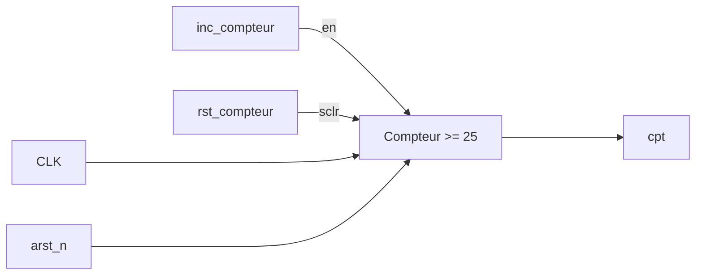
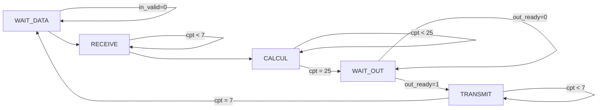

=======
header-includes:
	- \usepackage{multicol}
	- \newcommand{\hideFromPandoc}[1]{#1}
	- '\hideFromPandoc{
		\def\beginmini{\begin{minipage}[t]}
		\def\endmini{\end{minipage}}
	  }'
...

## 2.1

$\text{A et B au format (1;l;n)}$

$S_1 = A + B \\$
$=A_r+iA_i + B_r + iB_i \\$
$=A_r + B_r + i(A_i + B_i)\\$

$S_{1r} = A_r + B_r\\$
$S_{1i} = A_i + B_i\\$

\
$S_2=w(A-B)\\$
$= ...\\$
$S_{2r} = w_rA_r-w_rB_r-w_iA_i+w_iB_i\\$
$S_{2i} = w_rA_i-w_rB_i-w_iA_r+w_iB_r$

## 2.1.2
### 2.1.2.1
$w_N^k=e^{-2i\frac{\pi k}{N}}\\$
$w_r \in \left[-1;1\right]\\$
$w_i \in \left[-1;1\right]$

### 2.1.2.2
$10_b = -2\\$
$01_b = 1\\$
$\Rightarrow \text{2 bits}$

### 2.1.2.3
$w_8^1=e^{\frac{-2i\pi}{8}}=e^{\frac{-i\pi}{4}} \hspace{2cm} Re(w_8^1)=\frac{\sqrt{2}}{2}\\$
$w_{th}=\sum^1_{i=-\infty}w_i2^i \hspace{2cm} w=\sum^1_{i=-m}w_i2^i\\$
$\text{valeur calculée}=w\times(A-B)\\$
$\text{valeur théorique}=w_th\times(A-B)\\$
$\text{On cherche m el que |Erreur|} \le 2^{-m}\\$
$|Erreur|=|w\times(A-B)-w_th\times(A-B)|=|w-w_th|\times|A-B|\\$

$\text{A et B : (1;l;n)}\hspace{2cm}\text{A-B}:(1;l+1;n)\\$
$|A-B|\le2^{l-n}\\$
$|w-w_th|=|\sum^1_{i=-m}w_i2^i-\sum^1_{i=-\infty}w_i2^i|\\$
$|w-w_th|=|\sum^{-m-1}_{i=-\infty}w_i2^i|\\$
$|w-w_th|\le|\sum^{-m-1}_{i=-\infty}2i| \hspace{2cm} \text{car } w_i=0 \text{ ou } 1\\$
$...\\$
$|Erreur|\le2^{-n}\\$
$\Leftrightarrow2^{l-n-m}\le 2^{-n}\\$
$\Leftrightarrow2^{l-m}\le 1\\$
$\Leftrightarrow2^{l}\le 2^m\\$

### 2.1.2.4
$\text{A et B }(1;l;m)\\$
$w_r \text{ et } w_i \text{ 2 bits partie entière et l bits partie après la virgule}\\$
$w_r \text{ et } w_i \text{ } (1;l+2;l)\\$

### 2.1.2.5
$S_1 = A+B \Rightarrow (1;l+1;n)\\$
$S_2 = w(A-B) \Rightarrow (1;l+1;n) \hspace{2cm} w\in \left]-1;1\right]\\$

### 2.1.2.6
$\text{On augmente de 1 bits à chaque étage} \Rightarrow (1;l+3;n)$

### 3.2.1
Moore
: sortie dépend de l'état présent  

Mealy
: sortie dépend de l'état présent et des entrées

### 3.2.2

~~~mermaid
graph LR
    Entrées-->Calcul[Calcul état suivant]
    Calcul-->Registre[Registre d'état]
    Registre-->CalculS[Calcul sorties]
    CalculS-->Sorties
    Entrées-->CalculS
    Registre-->Calcul
    clk-->Registre
    
~~~

### 3.2.3
`arst_n`
: réinitialisation de la FSM

`clk`
: horloge

`in_valid`
: la donnée en entreée est à prendre en compte

`out_ready`
: le composant en sortie est prêt à recevoir une donnée

`in_ready`
: si on est prêt à recevoir une donnée

`out_valid`
: la valeur en sortie doit être prise en compte par le composant suivant  

en1
: activation du registre 1

en2
: activation du registre 2

en3
: activation du registre 3

### 3.2.4
Entrées : `in_valid` et `out_ready`

~~~mermaid
graph LR
    E000--0X-->E000
    E000--1X-->E100
    E100--0X-->E010
    E100--1X-->E110
    E110--0X-->E011
    E011--00-->E011
    E110--1X-->E111
    E010--1X-->E101
    E010--0X-->E001
    E011--01-->E001
    E011--10-->E111
    E011--11-->E101
    E111--00-->E111
    E111--01-->E011
    E111--10-->E111
    E111--11-->E111
    E101--00-->E011
    E101--01-->E010
    E101--10-->E111
    E101--11-->E110
    E001--00-->E001
    E001--01-->E000
    E001--10-->E101
    E001--11-->E100
~~~

+--------------+--------------+--------------+--------------+--------------+--------------+
| État présent | `in_ready`   | `out_valid`  | `en1`        | `en2`        | `en3`        |
+:============:+:============:+:============:+:============:+:============:+:============:+
| E000         | 1            | 0            | 1            | 1            | 1            |
+--------------+--------------+--------------+--------------+--------------+--------------+
| E001         | 1            | 1            | 1            | 1            | `out_ready`  |
+--------------+--------------+--------------+--------------+--------------+--------------+
| E010         | 1            | 0            | 1            | 1            | 1            |
+--------------+--------------+--------------+--------------+--------------+--------------+
| E011         | 1            | 1            | 1            | `out_ready`  | `out_ready`  |
+--------------+--------------+--------------+--------------+--------------+--------------+
| E100         | 1            | 0            | 1            | 1            | 1            |
+--------------+--------------+--------------+--------------+--------------+--------------+
| E101         | 1            | 1            | 1            | 1            | `out_ready`  |
+--------------+--------------+--------------+--------------+--------------+--------------+
| E110         | 1            | 0            | 1            | 1            | 1            |
+--------------+--------------+--------------+--------------+--------------+--------------+
| E111         | `out_ready`  | 1            | `out_ready`  | `out_ready`  | `out_ready`  |
+--------------+--------------+--------------+--------------+--------------+--------------+

## Approche itérative

### Réception

R | W
-:|:-:
X | 0
X | 1
X | 2
X | 3
X | 4
X | 5
X | 6
X | 7
X | 8
X | 9

### Calcul

R | W
-:|:-:
0 | X
4 | X
1 | 0
5 | 4
2 | 1
6 | 5
3 | 2
7 | 6

R | W
-:|:-:
0 | 3
2 | 7
1 | 0
3 | 2
4 | 1
6 | 3
5 | 4
7 | 6

R | W
-:|:-:
0 | 5
1 | 7
2 | 0
3 | 1
4 | 2
5 | 3
6 | 4
7 | 5
X | 6
X | 7

### Transmission

R | W
-:|:-:
0 | X
1 | X
2 | X
3 | X
4 | X
5 | X
6 | X
7 | X

+-------------------+--------------+--------------+--------------+--------------+--------------+--------------+
|                   | `out_valid`  | `in_ready`   | `inc_cpt`    | `rst_cpt`    | `w_en`       | `sel_input1` |
+===================+:============:+:============:+:============:+:============:+:============:+:============:+
| WAIT_DATA         | 0            | 1            | `in_valid`   | 0            | 1            | 0            |
+-------------------+--------------+--------------+--------------+--------------+--------------+--------------+
| RECEIVE           | 0            | 0            | 1            | `cpt = 7`    | 1            | 0            |
+-------------------+--------------+--------------+--------------+--------------+--------------+--------------+
| CALCUL            | 0            | 0            | 1            | `cpt = 25`   | `cpt > 1`    | 1            |
+-------------------+--------------+--------------+--------------+--------------+--------------+--------------+
| WAIT_OUT          | 1            | 0            | `out_ready`  | 0            | 0            | X            |
+-------------------+--------------+--------------+--------------+--------------+--------------+--------------+
| TRANSMIT          | 0            | 0            | 1            | 1            | 1            | 1            |
+-------------------+--------------+--------------+--------------+--------------+--------------+--------------+

### /!\\ Il reste les signaux
- `sel_butterfly_output`: dépend qe de cpt
- k
- `w_addr` et `r_addr`: dependent de `cpt` et de l'état présent
=======
# Architecture itérative

3 phases :
* Réception
* Calcul
* Transmission

Tout mettre sur 15 bits (rajouter 3 fois le bit de signe à l'entrée)

## Adresses RAM

\beginmini{0.3\textwidth}

### Réception

 R | W
:-:|:-:
 X | 0
 X | 1
 X | 2
 X | 3
 X | 4
 X | 5
 X | 6
 X | 7

\endmini
\beginmini{0.3\textwidth}

### Calcul

 R | W
:-:|:-:
 0 | X
 4 | X
 1 | 0
 5 | 4
 2 | 1
 6 | 5
 3 | 2
 7 | 6
 0 | 3
 2 | 7
 1 | 0
 3 | 2
 4 | 1
 6 | 3
 5 | 4
 7 | 6
 0 | 5
 1 | 7
 2 | 0
 3 | 1
 4 | 2
 5 | 3
 6 | 4
 7 | 5
 X | 6
 X | 7

\endmini
\beginmini{0.3\textwidth}

### Transmission

 R | W
:-:|:-:
 0 | X
 4 | X
 2 | X
 6 | X
 1 | X
 5 | X
 3 | X
 7 | X

\endmini
