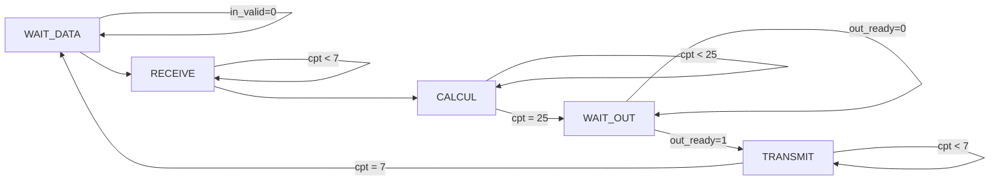

---
title: Implémentations de l'algorithme FFT en VHDL
subtitle: Rapport de projet
author:
	- Arthur Gaudard
	- Morgan Van Amerongen
date: Vendredi 17 novembre 2023
lang: fr
documentclass: article
numbersections: true
geometry:
	- margin=1in
toc: true
toc-depth: 3
block-headings: true
indent: true
header-includes:
	- \usepackage{circuitikz}
    - \newcommand{\hideFromPandoc}[1]{#1}
    - \hideFromPandoc{
        \let\Begin\begin
        \let\End\end
      }
...

# Presentation

# Opérateur papillon

## Théorie

## Implémentation

# Architecture pipeline

## Préparation

## Implémentation

## Performances

# Architecture itérative

## Préparation

### Machine d'état

Pour l'architecture itérative, nous allons faire une nouvelle machine d'état de Mealy. Le graph la décrivant est sur la figure \ref{fig:iterative_sm_graph}.

\Begin{figure}

\caption{test}
\label{fig:iterative_sm_graph}
\End{figure}

Nous pouvons ensuite écrire un tableau décrivant les différentes valeurs que doivent prendre les paramètres de la machine en fonction de l'état présent.
### Séquencage d'adresses

## Implémentation

## Performances

# Architecture hybride

## Préparation

## Structure
