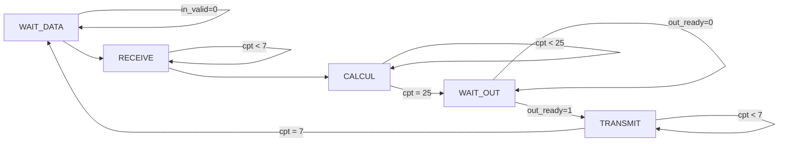

---
title: Implémentations de l'algorithme FFT en VHDL
subtitle: Rapport de projet
author:
	- Arthur Gaudard
	- Morgan Van Amerongen
date: Vendredi 17 novembre 2023
lang: fr
documentclass: article
numbersections: true
geometry:
	- margin=1in
toc: true
toc-depth: 3
block-headings: true
indent: true
header-includes:
	- \usepackage{circuitikz}
    - \newcommand{\hideFromPandoc}[1]{#1}
    - \hideFromPandoc{
        \let\Begin\begin
        \let\End\end
      }
...

# Presentation

# Opérateur papillon

## Théorie

## Implémentation

# Architecture pipeline

## Préparation

\Begin{figure}
~~~mermaid
graph LR
    E000--0X-->E000
    E000--1X-->E100
    E100--0X-->E010
    E100--1X-->E110
    E110--0X-->E011
    E011--00-->E011
    E110--1X-->E111
    E010--1X-->E101
    E010--0X-->E001
    E011--01-->E001
    E011--10-->E111
    E011--11-->E101
    E111--00-->E111
    E111--01-->E011
    E111--10-->E111
    E111--11-->E111
    E101--00-->E011
    E101--01-->E010
    E101--10-->E111
    E101--11-->E110
    E001--00-->E001
    E001--01-->E000
    E001--10-->E101
    E001--11-->E100
~~~
\caption{Graph de la machine de Mealy pour l'architecture \textit{Full pipeline}}
\label{pipeline_sm_graph}
\End{figure}

\Begin{figure}
+--------------+--------------+--------------+--------------+--------------+--------------+
| État présent | `in_ready`   | `out_valid`  | `en1`        | `en2`        | `en3`        |
+:============:+:============:+:============:+:============:+:============:+:============:+
| E000         | 1            | 0            | 1            | 1            | 1            |
+--------------+--------------+--------------+--------------+--------------+--------------+
| E001         | 1            | 1            | 1            | 1            | `out_ready`  |
+--------------+--------------+--------------+--------------+--------------+--------------+
| E010         | 1            | 0            | 1            | 1            | 1            |
+--------------+--------------+--------------+--------------+--------------+--------------+
| E011         | 1            | 1            | 1            | `out_ready`  | `out_ready`  |
+--------------+--------------+--------------+--------------+--------------+--------------+
| E100         | 1            | 0            | 1            | 1            | 1            |
+--------------+--------------+--------------+--------------+--------------+--------------+
| E101         | 1            | 1            | 1            | 1            | `out_ready`  |
+--------------+--------------+--------------+--------------+--------------+--------------+
| E110         | 1            | 0            | 1            | 1            | 1            |
+--------------+--------------+--------------+--------------+--------------+--------------+
| E111         | `out_ready`  | 1            | `out_ready`  | `out_ready`  | `out_ready`  |
+--------------+--------------+--------------+--------------+--------------+--------------+
\caption{Valeur des paramètres de la machine d'état pour l'architecture \textit{Full Pipeline}}
\label{fig:pipeline_sm_table}
\End{figure}

## Implémentation

## Performances

# Architecture itérative

## Préparation

### Machine d'état

Pour l'architecture itérative, nous allons faire une nouvelle machine Mealy. Le graph la décrivant est sur la figure \ref{fig:iterative_sm_graph}.

\Begin{figure}

\caption{Graph de la machine Mealy pour l'architecture \textit{Full Iterative}}
\label{fig:iterative_sm_graph}
\End{figure}

Nous pouvons ensuite écrire un tableau décrivant les différentes valeurs que doivent prendre les paramètres de la machine en fonction de l'état présent. Voir figure \ref{fig:iterative_sm_table}.

\Begin{figure}
+-------------------+--------------+--------------+--------------+--------------+--------------+--------------+
|                   | `out_valid`  | `in_ready`   | `inc_cpt`    | `rst_cpt`    | `w_en`       | `sel_input1` |
+===================+:============:+:============:+:============:+:============:+:============:+:============:+
| WAIT_DATA         | 0            | 1            | `in_valid`   | 0            | 1            | 0            |
+-------------------+--------------+--------------+--------------+--------------+--------------+--------------+
| RECEIVE           | 0            | 0            | 1            | `cpt = 7`    | 1            | 0            |
+-------------------+--------------+--------------+--------------+--------------+--------------+--------------+
| CALCUL            | 0            | 0            | 1            | `cpt = 25`   | `cpt > 1`    | 1            |
+-------------------+--------------+--------------+--------------+--------------+--------------+--------------+
| WAIT_OUT          | 1            | 0            | `out_ready`  | 0            | 0            | `X`          |
+-------------------+--------------+--------------+--------------+--------------+--------------+--------------+
| TRANSMIT          | 0            | 0            | 1            | 1            | 1            | 1            |
+-------------------+--------------+--------------+--------------+--------------+--------------+--------------+
\caption{Valeur des paramètres de la machine d'état pour l'architecture \textit{Full Iterative}}
\label{fig:iterative_sm_table}
\End{figure}

### Séquencage d'adresses

## Implémentation

## Performances

# Architecture hybride

## Préparation

## Structure
