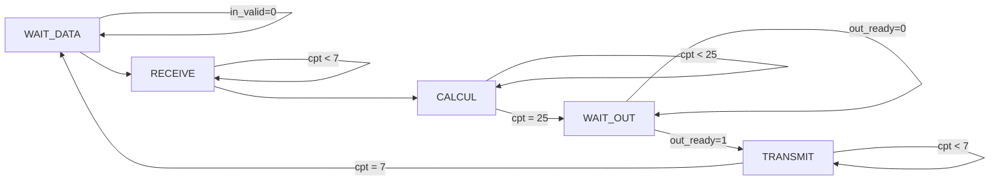
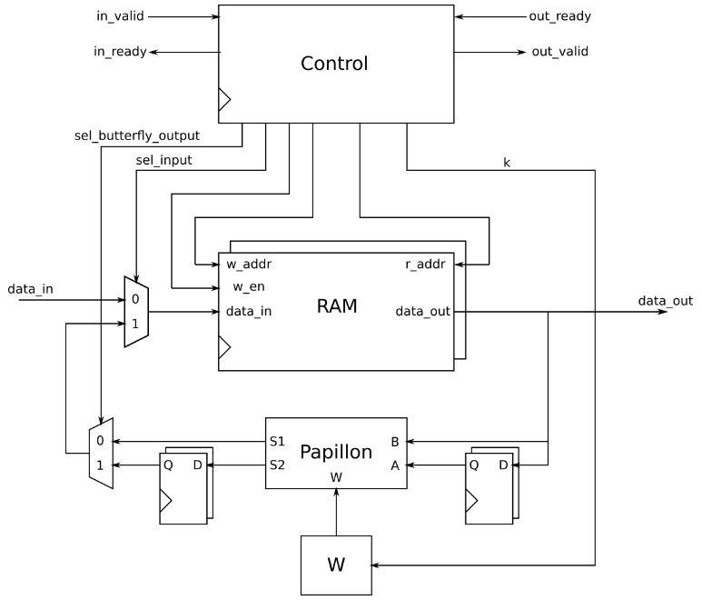

---
title: Implémentations de l'algorithme FFT en VHDL
subtitle: Rapport de projet
author:
	- Arthur Gaudard
	- Morgan Van Amerongen
date: Vendredi 17 novembre 2023
lang: fr
documentclass: article
numbersections: true
geometry:
	- margin=1in
toc: true
toc-depth: 3
block-headings: true
indent: true
header-includes:
	- \usepackage{circuitikz}
    - \newcommand{\hideFromPandoc}[1]{#1}
    - \hideFromPandoc{
        \let\Begin\begin
        \let\End\end
      }
...

# Presentation

# Opérateur papillon

## Théorie

Le calcul du spectre est basé sur un opérateur complexe appelé "papillon". Cet opérateur prend en entrée deux nombres complexes $A$ et $B$ ainsi qu'un coefficient unitaire $w^k_n$, et possède deux sorties complexes $S_1 = A+B$ et $S_2 = w^k_n(A-B)$ (voir fig. \ref{fig:butterfly}).

\begin{centering}
\begin{figure}
\begin{circuitikz}
\draw
(0,0) node[coupler, scale=2](butt){}
(butt.n) node[above]{Papillon}
(butt.left up) to[short, -o] ++(-1,0) node[left, font=\huge]{$A$}
(butt.left down) to[short, -o] ++(-1,0) node[left, font=\huge]{$B$}
(butt.right up) to[short, -o] ++(1,0) node[right, font=\huge]{$A+B$}
(butt.right down) to[short, -o] ++(1,0) node[right, font=\huge]{$w^k_n(A-B)$}
(butt.s) to[short, -o] ++(0,-1) node[below, font=\huge]{$w^k_n$};
\end{circuitikz}
\caption{L'opérateur papillon}
\label{fig:butterfly}
\end{figure}
\end{centering}

$A$ et $B$ sont codés comme des nombres à virgule fixe au format $(1;l;n)$ 

## Implémentation

# Architecture pipeline

## Préparation

\Begin{figure}
~~~mermaid
graph LR
    E000--0X-->E000
    E000--1X-->E100
    E100--0X-->E010
    E100--1X-->E110
    E110--0X-->E011
    E011--00-->E011
    E110--1X-->E111
    E010--1X-->E101
    E010--0X-->E001
    E011--01-->E001
    E011--10-->E111
    E011--11-->E101
    E111--00-->E111
    E111--01-->E011
    E111--10-->E111
    E111--11-->E111
    E101--00-->E011
    E101--01-->E010
    E101--10-->E111
    E101--11-->E110
    E001--00-->E001
    E001--01-->E000
    E001--10-->E101
    E001--11-->E100
~~~
\caption{Graph de la machine de Mealy pour l'architecture \textit{Full pipeline}}
\label{pipeline_sm_graph}
\End{figure}

\Begin{figure}
+--------------+--------------+--------------+--------------+--------------+--------------+
| État présent | `in_ready`   | `out_valid`  | `en1`        | `en2`        | `en3`        |
+:============:+:============:+:============:+:============:+:============:+:============:+
| E000         | 1            | 0            | 1            | 1            | 1            |
+--------------+--------------+--------------+--------------+--------------+--------------+
| E001         | 1            | 1            | 1            | 1            | `out_ready`  |
+--------------+--------------+--------------+--------------+--------------+--------------+
| E010         | 1            | 0            | 1            | 1            | 1            |
+--------------+--------------+--------------+--------------+--------------+--------------+
| E011         | 1            | 1            | 1            | `out_ready`  | `out_ready`  |
+--------------+--------------+--------------+--------------+--------------+--------------+
| E100         | 1            | 0            | 1            | 1            | 1            |
+--------------+--------------+--------------+--------------+--------------+--------------+
| E101         | 1            | 1            | 1            | 1            | `out_ready`  |
+--------------+--------------+--------------+--------------+--------------+--------------+
| E110         | 1            | 0            | 1            | 1            | 1            |
+--------------+--------------+--------------+--------------+--------------+--------------+
| E111         | `out_ready`  | 1            | `out_ready`  | `out_ready`  | `out_ready`  |
+--------------+--------------+--------------+--------------+--------------+--------------+
\caption{Valeur des paramètres de la machine d'état pour l'architecture \textit{Full Pipeline}}
\label{fig:pipeline_sm_table}
\End{figure}

## Implémentation

## Performances

# Architecture itérative

## Préparation

### Machine d'état

Pour l'architecture itérative, nous allons faire une nouvelle machine Mealy. Le graph la décrivant est sur la figure \ref{fig:iterative_sm_graph}.

\Begin{figure}

\caption{Graph de la machine Mealy pour l'architecture \textit{Full Iterative}}
\label{fig:iterative_sm_graph}
\End{figure}

Nous pouvons ensuite écrire un tableau décrivant les différentes valeurs que doivent prendre les paramètres de la machine en fonction de l'état présent. Voir figure \ref{fig:iterative_sm_table}.

\Begin{figure}
+-------------------+--------------+--------------+--------------+--------------+--------------+--------------+
|                   | `out_valid`  | `in_ready`   | `inc_cpt`    | `rst_cpt`    | `w_en`       | `sel_input1` |
+===================+:============:+:============:+:============:+:============:+:============:+:============:+
| WAIT_DATA         | 0            | 1            | `in_valid`   | 0            | 1            | 0            |
+-------------------+--------------+--------------+--------------+--------------+--------------+--------------+
| RECEIVE           | 0            | 0            | 1            | `cpt = 7`    | 1            | 0            |
+-------------------+--------------+--------------+--------------+--------------+--------------+--------------+
| CALCUL            | 0            | 0            | 1            | `cpt = 25`   | `cpt > 1`    | 1            |
+-------------------+--------------+--------------+--------------+--------------+--------------+--------------+
| WAIT_OUT          | 1            | 0            | `out_ready`  | 0            | 0            | `X`          |
+-------------------+--------------+--------------+--------------+--------------+--------------+--------------+
| TRANSMIT          | 0            | 0            | 1            | 1            | 1            | 1            |
+-------------------+--------------+--------------+--------------+--------------+--------------+--------------+
\caption{Valeur des paramètres de la machine d'état pour l'architecture \textit{Full Iterative}}
\label{fig:iterative_sm_table}
\End{figure}

### Séquencage d'adresses

Les tableaux suivants indiquent l'ordre dans lequel il faut adresser la RAM en lecture et en écriture.

#### Réception

 R | W
:-:|:-:
 X | 0
 X | 1
 X | 2
 X | 3
 X | 4
 X | 5
 X | 6
 X | 7

#### Calcul

 R | W
:-:|:-:
 0 | X
 4 | X
 1 | 0
 5 | 4
 2 | 1
 6 | 5
 3 | 2
 7 | 6
 0 | 3
 2 | 7
 1 | 0
 3 | 2
 4 | 1
 6 | 3
 5 | 4
 7 | 6
 0 | 5
 1 | 7
 2 | 0
 3 | 1
 4 | 2
 5 | 3
 6 | 4
 7 | 5
 X | 6
 X | 7

#### Transmission

 R | W
:-:|:-:
 0 | X
 4 | X
 2 | X
 6 | X
 1 | X
 5 | X
 3 | X
 7 | X

## Implémentation

L'implémentation de l'architecture *Full Iterative* n'utilise qu'une seule instance de l'opérateur papillion qui sera reutilisée pour toutes les opérations. Cela aura l'avantage d'utiliser moins de ressources dans la plupart des cas, mais sera aussi plus lent que l'architecture alternative.

La seule instance de l'opérateur papillion aura ses entrees et ses sorties branchées respectivement sur l'entrée et la sortie de la RAM. Comme la RAM n'a qu'une seule entrée et qu'une seule sortie, il faudra mettre une bascule sur une des entrées et sur une des sorties du papillion. Cela permettera de synchroniser les deux entrées et les deux sorties de l'opérateur papillion.

Deux multiplexeurs seront ajoutées pour controller si l'entrée de la RAM viendra de la sortie de l'opérateur papillion ou des données d'entrées.

Pour contrôler ce circuit, un compteur basique a été immplementé. Il permettera à la machine à état de décider des adresses auxquelle il faut lire dans la RAM et de calculer les différents états.

## Performances

Plus la taille des FFT sera grande, plus le gain de ressources de l'architecture *Full Iterative* sur l'architecture *Full Pipeline* sera évident. Avec les petites FFT que nous avons implémentés, l'avantage ne se voit pas car le seuil de ressources demandé par la RAM et les autres petits composants utilisés sera tout de même important.

# Architecture hybride

L'architecture hybride permet d'essayer de profiter des avantages de l'architecture itérative et de l'architecture pipeline. Il s'agira de combiner le parallèlisme de l'architecture pipeline avec le économie de ressource de l'architecture itérative.

## Préparation

## Structure
